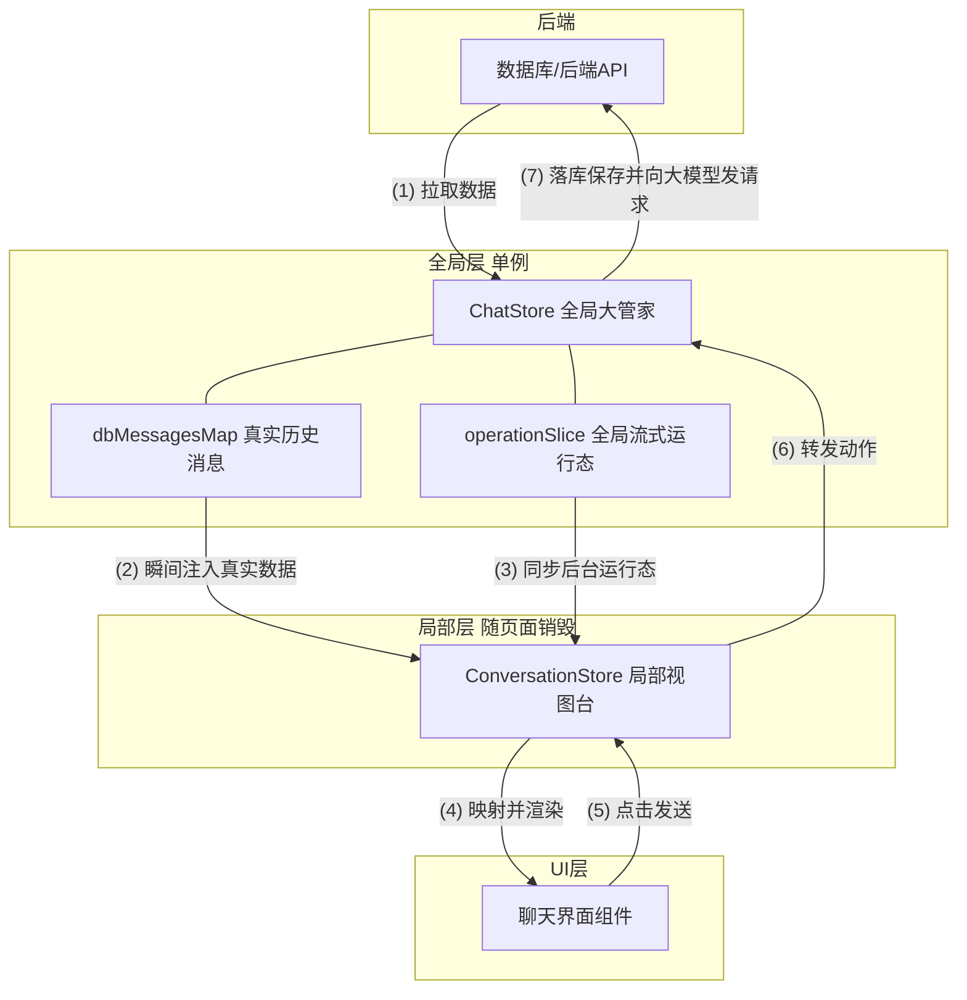
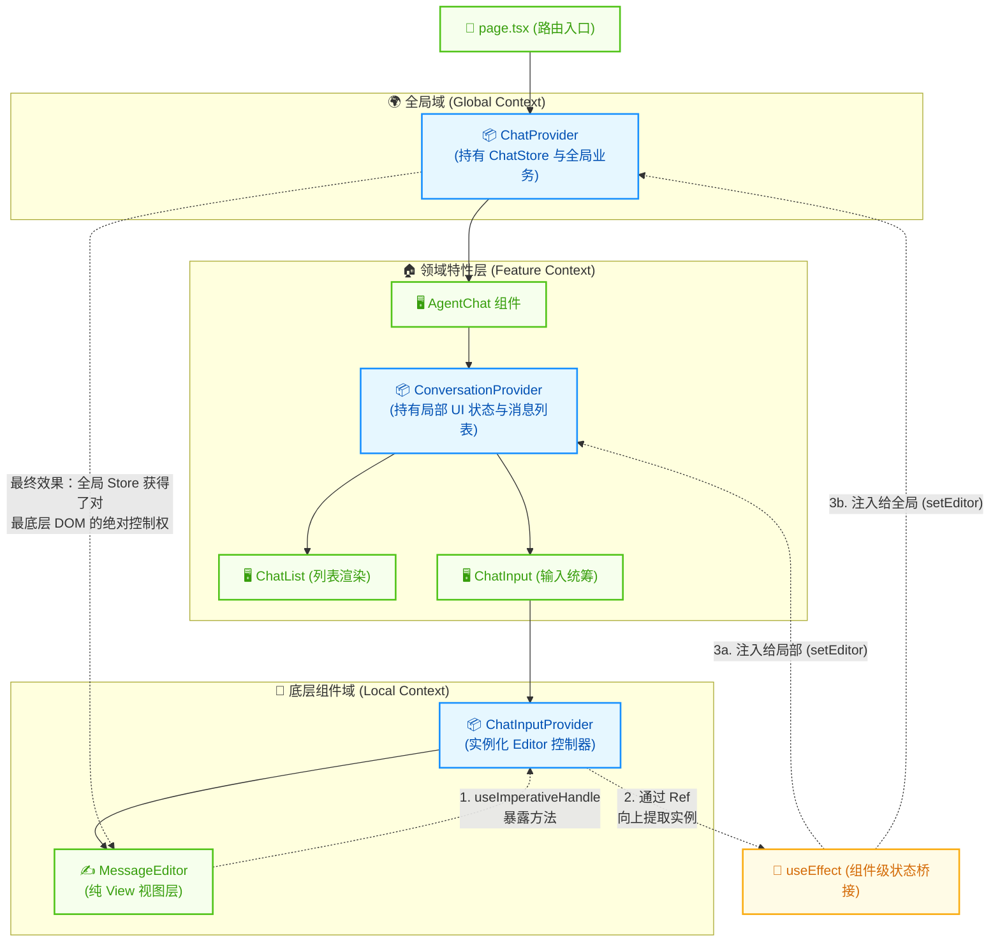

在真实的向后端开始发送数据之前，我们需要先认识一下前端的架构是如何实现的


# 基础架构
先说全局的数据架构如何实现，我们再讨厌页面以及ui的交互如何见缝插针的在这些store中进行实现
- 全局chatStore
- 单个converSationStore
- 更小的operationStore


接下来讲一下这些架构负责的都是哪些内容
chatstore属于最顶层的store数据库，它保存基本的对话以及信息，以map结构存储在本地，为了性能以及用户体验的考虑。每次刚进入页面时，store只会去后端请求最基本的一些概览信息，比如标题等，并渲染出当前有多少条历史信息等信息

当用户点击具体的topic（对话）时，向后端请求储存在数据库的具体信息，后端返回后同步更新到全局的chatstore，并且chastore开始创建一个全新的conversationStore实例，该实例接受全局chatStore的注入，开始进行初始化并暴露出send方法供给前端调用。

用户点击send，converSationStore开始启动状态机，即operationStore，并向后端发送信息，产生的信息都会同步到chatStore做备份

用户点击其他topic，组件立马销毁刚才创建的conversationStore，根据topicId从全局chatstore里拉取新的数据并使用`useLayoutEffect`注入新的conversationStore中。

## chatStore
第一个store是全局的chatStore，负责管理最核心的业务数据以及负责和后端进行交互。核心成员：
- **`ChatMessageState`**： 消息仓库，负责储存所有的信息`message`，并以不同的维度进行储存，方便进行查找
- **`ChatTopicState`**：会话目录，负责储存的是外层会话`topic`，并携带一些基础信息，方便点击时携带进行查询
- **`ChatOperateionState`**：任务调度，负责储存的是所有任务的状态，供外部查询，以不同的维度储存，可以视为状态机的外部调度
- **`ChatAiState`**：储存sse或者websocket实例，方便回溯或者销毁 
- **`inputState`**: 储存输入框

	**`ChatMessageState`**：
```ts
export interface ChatMessageState {
  // key 是当前会话上下文（比如 topicId）
  // value 是处理好等待直接渲染的 消息数组
  messagesMap: Record<string, UIChatMessage[]>;
}
```

**`ChatTopicState`**：
```ts
export interface TopicData {
  items: ChatTopic[];  // 这就是包含标题的数组！
  total: number;       // 总数
  hasMore: boolean;    // 是否可以继续翻页下拉
  currentPage: number; 
}
export interface ChatTopicState {
  // key 通常是 agentId，value 是上面的 TopicData
  topicDataMap: Record<string, TopicData>;
}
```
TopicData可以被视为是列表的一个核心数据，包含有当前侧边栏的一些信息，提供用户预览历史对话
**`ChatOperationState`**：
任务调度，提供一个实体的任务池，以及多个维度查询任务的字典
```ts
export interface ChatOperationState {
  // 1. 核心任务详情池
  // key 是 operationId，value 是具体的任务对象（包含状态 running/success、类型等）
  operations: Record<string, Operation>; 
  
  // 2. 反查表：消息 ID -> 任务 ID
  // key 是 messageId，value 是 operationId
  messageOperationMap: Record<string, string>;
  
  // 3. 反查表：会话上下文 -> 任务 ID 数组
  // key 是 agentId+topicId 的组合字符串，value 是该会话下的所有 operationId 数组
  operationsByContext: Record<string, string[]>;
}

```

**`ChatAiState`**
储存sse、websocket，存底层通道和底层行为状态
```ts
export interface ChatAIChatState {
  // 存放所有的 WebSocket 网关连接实例
  // key 是 operationId，value 是真实的连接对象
  gatewayConnections: Record<string, GatewayConnection>;
  
  // 底部输入框当前的草稿文本
  inputMessage: string;
  
  // 记录正在执行的本地工具
  pendingClientToolExecutions: Record<string, boolean>;
}

```


## 其他store
其他的store都是一些单独某些组件独享的
- conversationStore，储存当次对话有关的一些ui派生状态，比如决定当前的发送按钮是否可以点击
- chatinputstore，储存input输入框的引用等


这里使用了一些初次使用zustand或者react的人看来很复杂的一些架构方式。我们为了让顶层的store可以拿到底层store传递的数据，并且保证一些ref或者组件的引用使用保持在一个地方。
比如：顶层的chatstore、中间的conversationstore和底层的inputstore，分别对应顶层、中间的信息组件和底层的输入框组件。这时候我们需要三者都可以拿到用户输入了什么。你会选择怎么做？
答案：
1:最底层的inputstore创建一个provider，该provider只负责接受上层数据并交给store，并在组件渲染完毕以后传递给上一层的store，这一层是为什么呢？因为有一些像ref或者变量之类的地方无法在渲染的时候使用，可能会导致上一层的报错，所以我们需要这种中间组件
2:如何向上一级抛出呢？答案依然是使用props+回调，react只接受单向的数据流，我们只能让上级的store传递一个回调函数，交给子store，等待他渲染完毕后同步触发渲染函数，在渲染函数里同步修改




## 如何合理分配不同的层级控制渲染性能

现在这个架构我简单说一下就是这样运作的，一个chat容器的store分布是这样的：
- 最外层chatstore，负责几乎所有数据
- 中层conversationstore -负责只显示一些ui相关的数据
- 底层一些具体的组件store，像inputstore -负责控制输入框的数据

- 当我们从远程拉回来数据时，外层的chatstore负责接收数据并进行拆分等，几乎所有的逻辑处理都是在这里进行，chatstore将数据处理成可以被conversation store处理的结构后，推进conversation组件的props
- conversation组件有一个专门的provider和update无头组件，负责监听props中的信息，并转发给conversationstore
- conversation组件内的每个组件监听conversationstore的单个属性，并进行ui展示

可以看到，数据是单向的，从顶向下进行流动，不要忽视里面的updater，它是负责将数据进行中转，是桥接层。但是这要引来一个新的问题。这个store嵌套如此之多层，且拥有相当多的组件，当props改变时，组件内的所有页面都会被强制重新渲染，这肯定是一个对性能不好的消息。

如何避免这一点？lobehub的做法是使用一套组合拳：useMemo和store的局部监听
- useMemo：useMemo依赖于一个监听数组，当监听数组的属性没有变化时，内部的属性或者组件则不会响应react的rerender过程，我们可以用useMemo包裹着住一些不会频繁渲染的组件。
- 或者可以使用memo，memo只依赖于组件的props，这是专门用来给组件进行加载优化处理的一个api，也是react官方提供
- Store局部监听：当我们通过zustand的store来进行传递数据后，将会有一个很大的优势，zustand提供selector的方式来订阅数据，我们可以只订阅很小一部分的数据，这相当于usememo的监听，组件将只会在这部分数据变化的时候rerender


