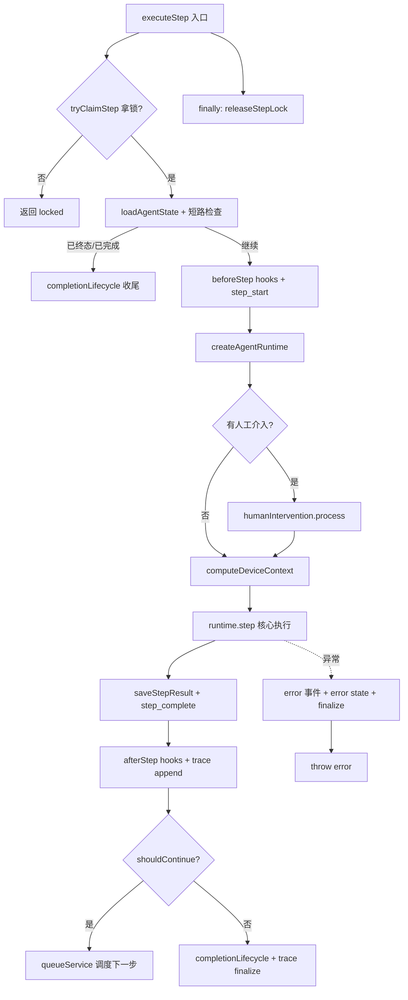

# 为什么要和大模型通信？

```mermaid
flowchart TD
  A[executeStep 入口] --> B{tryClaimStep 拿锁?}
  B -->|否| Z[返回 locked]
  B -->|是| C[loadAgentState + 短路检查]
  C -->|已终态/已完成| D[completionLifecycle 收尾]
  C -->|继续| E[beforeStep hooks + step_start]
  E --> F[createAgentRuntime]
  F --> G{有人工介入?}
  G -->|是| H[humanIntervention.process]
  G -->|否| I[computeDeviceContext]
  H --> I
  I --> J[runtime.step 核心执行]
  J --> K[saveStepResult + step_complete]
  K --> L[afterStep hooks + trace append]
  L --> M{shouldContinue?}
  M -->|是| N[queueService 调度下一步]
  M -->|否| O[completionLifecycle + trace finalize]
  J -.->|异常| P[error 事件 + error state + finalize]
  P --> Q[throw error]
  A --> R[finally: releaseStepLock]

```

# 通信的步骤

## call_llm
