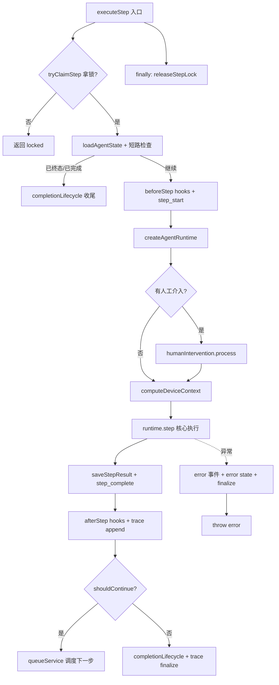

# 链条

- 前端呼叫路由（trpc）：前端点击了发送后，直接调用后端的trpc路由层，前端负责通过type判断是sse还是websocket，从而导向不同的路由层
- trpc路由层：在这里针对前端的传参进行一些校验
- 路由层：处理各种数据，拼接上下文，提取skill、工具、提取记忆，准备好agent需要的一切数据
- 通过队列，进入agent调度器，并发送operationId给前端
- 前端拿到operationId，立马发起请求请求网关，网关负责维持sse、websocket通道
- 后端接收到信息后进行接管，将刚才的上下文注册进agent引擎
- agent 引擎开始运转，引擎包含有引擎层、大脑层、执行层，每次将结果推入大脑，大脑做出决断，通知引擎，引擎推入执行层，执行层执行具体的的指令。
- 执行层每次执行完毕调用`StreamEventManager`，直接上升网关层，网关层拿到组装好的数据通过sse、websocket通道返回给前端层

# 提前准备
在这里服务端会需要做一些事情：
- 检查前端提交过来的数据有没有特定指向的agent
- 检查这次提交是否是是恢复的信息，主要聚焦于大模型调用工具发起人类审核的中断 #agent工具
	 - 将最后一条信息标记为已批准或拒绝批准，准备后续让引擎来处理
	 - 更新数据库中的信息，这里的messageid是后端在接收到llm调用工具申请时生成的
	 - 如果是拒绝批准，继续发送消息，但是告诉大模型已经拒绝申请，已批准和拒绝批准的类型都是`tool_call`
- 检查有没有topicid，没有则在数据库中创建好一个对话基础结构，绑定像用户id、agentid等基础信息
	- 后续的message或者已经存在的message不在这里进行与对话进行绑定，我知道这是一个对前端来说可能有点反直觉的东西，但是message单独存在一张表里，通过topicid来与对话表进行链接
- 从用户数据库中提取出用户设置，准备后续使用
- 检查工具，检查是否可用，将可用的工具建立一个map准备发送给引擎
- 提取出用户画像
- 消息判断，检查消息时效性，提取出所有历史记录
	- 如果发现用户是回滚的信息，则删掉不应该存在的信息，以前端发过来的信息列表为准，删掉不位于前端列表中的信息
	- 如果是正常发送的消息，则从数据库里拉出所有需要的历史消息
- 开始检查用户上传的文件用于多模态对话 #附件上传
	- 处理好用户上传的附件，抹平成统一的oss地址
	- 如果是pdf等不好解析的文件，启动本地服务进行文本抽取，转成纯文字
	- 图片、视频、其他文件都分开存放
- 在数据库中根据用户发送的消息创建一个assistant ID，以便后续使用
- 创建好operation ID，该operationID绑定的是这次agentruntime操作
- 现在所有的信息都全部已经处理完毕，包含有operationID、上下文、llm的config、工具等，将这些捏合成上下文准备发送给runtime

 外围的引擎执行示意图：


# 调度层 #agentruntime

刚才我们已经准备好了一切的需要准备的步骤，现在只需要组装好agent并开始运行即可，需要注意一些不同的功能界限：
 服务层只负责：用户传来的数据、对话相关的历史信息等，这里的信息是与这次对话进行强绑定的。
 调度层只负责：负责处理服务层和runtime层不好处理的部分，像处理任务的生命周期以及步骤驱动
 runtime层只负责：一切与agent逻辑相关的，包括执行器，事件流管理器等，大脑，runtime等。
 这是为了功能解耦，服务层可以调用不同的方法来组装不同规格的引擎，引擎也可以接受不同的参数从而接入不同的接口。
 
 步骤：
 - 启动一个while循环，直到超出限制
 - 从数据库里检查当前该任务是否已经是中断或者结束，防止冲突
 - 根据用户传入的config开始创建引擎
 - 直接开始执行引擎
 - 卡住，等待引擎执行完毕
 - 引擎执行完一个step，向外抛出step执行完毕的事件，
 - 检查有没有用户点击中断
 - 将状态落库
 - 并由调度层推入下一个循环
 - 通知前端这一步结束
 - 根据状态开始计算，是否需要中断循环。
 - 数据会被封装的订阅器进一步拦截，触发接口将数据发送到网关层或者sse接口，经由接口转发给前端


流程图：
 ```mermaid

sequenceDiagram

autonumber

participant Client as 前端<br>(View 层)

participant Orchestrator as 大管家<br>(AgentRuntimeService)

participant Brain as 大脑<br>(GeneralChatAgent)

participant Executor as 执行器工厂<br>(RuntimeExecutors)

participant LLM as 大模型接口

participant Tool as 外部工具API

Note over Client, Orchestrator: 第一轮：首次发问与 LLM 决策

Client->>Orchestrator: 1. 用户发送：“北京天气？”

Orchestrator->>Brain: 2. 带着上下文询问下一步该干啥

Brain-->>Orchestrator: 3. 下发指令：{type: 'call_llm'}

Orchestrator->>Executor: 4. 走进 call_llm 车间

Executor->>LLM: 5. 发起流式 HTTP 请求

LLM-->>Executor: 6. 决定调工具，返回 tool_calling

Executor-->>Client: 7. publish(chunkType: 'tools_calling')<br>前端界面开始转圈圈：“正在查询天气”

Executor-->>Orchestrator: 8. 流结束打扫战场，返回 hasToolsCalling: true

Note over Orchestrator: 架构精髓：如果是 Serverless 云端，<br>大管家会把请求发到消息队列（MQ）后立刻返回。<br>MQ 再拉起第二轮，保证绝对不超时。

Note over Client, Orchestrator: 第二轮：在后端真实执行工具代码

Orchestrator->>Brain: 9. 拿着上一轮的状态再次询问

Brain-->>Orchestrator: 10. 看见有工具待执行，下发指令：{type: 'call_tool'}

Orchestrator->>Executor: 11. 走进 call_tool 车间

Executor->>Tool: 12. 调用真实的高德天气等外部 API

Tool-->>Executor: 13. 返回真实数据：{"temp": 25}

Executor-->>Client: 14. publish(tool_result)<br>前端界面 UI 打上绿色的对钩

Executor-->>Orchestrator: 15. 把 25 度写进数据库上下文

Note over Client, Orchestrator: 第三轮：结合工具结果进行最终总结

Orchestrator->>Brain: 16. 拿着包含“25度”的最新上下文询问

Brain-->>Orchestrator: 17. 发现有了结果，下发指令：{type: 'call_llm'}

Orchestrator->>Executor: 18. 再次走进 call_llm 车间

Executor->>LLM: 19. 携带“北京25度”发起流式 HTTP 请求

LLM-->>Executor: 20. 触发 onText 开始真正吐字

Executor-->>Client: 21. publish(chunkType: 'text')<br>前端呈现“打字机”流式效果

Executor-->>Orchestrator: 22. 吐字完毕流结束，没有要调的工具了

Orchestrator->>Brain: 23. 最终询问

Brain-->>Orchestrator: 24. 任务圆满完成，不返回指令

Orchestrator-->>Client: 25. 派发 step_complete 事件<br>(nextStepScheduled: false)<br>前端彻底结束 Loading，恢复发送按钮

```

# 通知层
[[agent开发部分/lobehub解析/ai架构/后端 - 订阅发布模式]]

# 引擎层  #agentruntime
[[agent开发部分/lobehub解析/ai架构/后端 - 物理执行器]]


