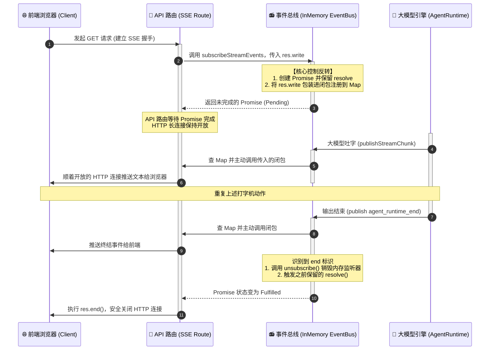

---
aliases:
  - 后端 - 订阅发布模式
tags:
  - 后端
  - 发布订阅
  - LobeHub
  - SSE
status: 待完善
created: 2026-06-14
---

# 梗概 📌

使用 Node.js 实现发布-订阅模式。当前服务器内所有的 Agent 服务都通过这个发布-订阅器发布事件，每个服务都用 `operationId` 进行隔离。Agent 负责发布消息，SSE / WebSocket 负责订阅该发布器。

# 订阅器的核心功能

- 发布
- 订阅
- 取消订阅
- 清理、释放内存

本质上，订阅器的核心就是维护一个 `Map` 或数组，在触发时遍历其中的回调并执行。

我们只需要让这个 `Map` 中的每一项都保存一组执行回调，并持续维护这些回调即可。

## 订阅

订阅使用到了闭包。既然我们想要区分不同的订阅，就需要一个持久化的变量，这样才可以在订阅后拿到对应的 `id` 进行取消。

```typescript
subscribe(id, callback): () => void {
  let callbacks = this.list.get(id);

  if (!callbacks) {
    callbacks = [];
    this.list.set(id, callbacks);
  }

  callbacks.push(callback);

  return () => {
    const cbs = this.list.get(id);

    if (cbs) {
      const index = cbs.indexOf(callback);

      if (index > -1) {
        cbs.splice(index, 1);
      }
    }
  };
}
```

每次订阅时：

- 检查当前订阅者数组中有没有对应的回调容器，如果没有就创建并推入。
- 注意通过 `Map.get` 拿到的是一个内存引用，可以直接通过 `push` 向这个数组里推入回调。
- 最后通过闭包，让内部函数引用外部的 `id`，这样就可以持久化保存这个 `id`。
- 订阅方拿到这个内部函数后，可以在需要时触发 `splice` 移除订阅。

## 发布

发布很简单。我们维护的订阅方数组已经按 `id` 维度保存了一批回调，发布方只需要取出这些回调并调用即可。

```typescript
async publishStreamEvent(id, data) {
  const callbacks = this.list.get(id);

  if (callbacks) {
    for (const callback of callbacks) {
      try {
        callback(data);
      } catch (error) {
        // ignore callback error
      }
    }
  }
}
```

这就是一个很简单的发布-订阅模式模型。

# 实现

但是为了应对 Agent 的发布-订阅场景，我们不能只使用这么简单的发布-订阅模型。单一结构无法应对 Agent 的多个运行任务。仔细想想，到底缺了什么？

发布方需要给订阅方什么呢？

最基本的肯定是数据流。但是数据流需要持久化维护，不然怎么拿到以前推过的事件？这里可以先用一个数组对象存储缓存。

其次，我们还需要针对 SSE 这种长连接请求做适配。这里先讲一下 SSE 在服务端的表现。 #sse

## SSE 在后端的维持 🔗

我本来以为 SSE 在前端是这样运行的：直接打开端口，然后后端可以主动向前端传递数据，每次传递完后端服务层就进入等待状态。

但是根据我后来的理解，一个正常的 SSE 接口是这样运行的：

1. 前端请求接口，后端接口响应，后端执行特定方法开始创建长连接并订阅，期间一直等待 `resolve`。
2. 大模型开始运行，此时引擎往订阅器中推入事件并通知订阅方，这一步不会 `resolve`。
3. 大模型期间吐词多次，每次都以同样的方式推给前端，期间这个特定方法不会中断。
4. 大模型输出结束，通知订阅器这是最后一次吐词，并触发 `resolve`。
5. 外层服务层监听到吐词结束，主动 `await` 完毕，然后中断 SSE。

所以为了维持这种特殊的架构方式，我们需要使用一种 Promise 化回调的方式。

这里需要触发某种监听，**但千万注意：这绝对不是把整个 Node 进程“暂停”或卡死**。本质上，我们利用了一个一直不 `resolve` 的 Promise，把当前 HTTP 响应挂起。此时长连接保持开放，同时把控制权交还给事件循环，这样服务器仍然可以处理其他请求。

直到监听到大模型发出的 `agent_runtime_end` 信号，再触发之前保留的 `resolve`。这其实是一个异步非阻塞操作，用来实现控制反转。

```typescript
async subscribeStreamEvents(
  id,
  onEvents: (events: StreamEvent[]) => void,
) {
  return new Promise((resolve) => {
    const unsubscribe = this.subscribe(operationId, (events) => {
      onEvents(events);

      const hasEnd = events.some((e) => e.type === 'agent_runtime_end');

      if (hasEnd) {
        unsubscribe();
        resolve();
      }
    });
  });
}
```

这一段就是 Promise 化回调。我们直接封装回调方法，让监听方在调用该方法时传入 `onEvents`。后续创建 SSE 连接时，当前请求会等待这个 Promise 完成。因为 Promise 还没有 `resolve`，所以当前 HTTP 响应会保持打开，直到 `resolve` 被触发。



## 发布事件

```typescript
async publishStreamEvent(operationId, event) {
  const eventId = this.generateEventId();

  const eventData = {
    ...event,
    id: eventId,
    operationId,
    timestamp: Date.now(),
  };

  // 检查本地是否已经有缓存
  let stream = this.streams.get(operationId);

  if (!stream) {
    stream = [];
    this.streams.set(operationId, stream);
  }

  stream.push(eventData);

  // 检查缓存是否已经超出
  if (stream.length > 1000) {
    stream.shift();
  }

  // 触发所有订阅者
  const callbacks = this.subscribers.get(operationId);

  if (callbacks) {
    for (const callback of callbacks) {
      try {
        callback([eventData]);
      } catch (error) {
        // ignore callback error
      }
    }
  }

  return eventId;
}
```

## 还有一个重点：缓存

一般来说，线上项目会使用 Redis 或其他方案来完成缓存。不过这里先不展开 Redis 形态，后续再单独补。当前为了简单，可以先使用一个本地 `Map` 对象代替。

缓存的意义是什么？

之前别的文章里提到过，可能会出现 stream 流不一致或网络中断的情况。前端每次恢复连接时，都要求后端对齐数据。

我们只需要在内存里维护一个 `stream` 数组，就能先处理这个问题。但这里有两个为了应对真实线上环境的操作：

1. **防止内存膨胀（OOM）保护**：数组不能无限塞，所以代码里限制长度超过 1000 就 `shift()` 丢掉老数据，变成一个有界队列。
2. **降低 ID 碰撞概率**：如果只靠 `Date.now()` 当事件 ID，高并发下同一毫秒吐好几个词可能会撞车。所以这里用了 `<时间戳>-<毫秒内自增序列号>` 的组合 ID。这样前端重连时带着 `lastEventId` 过来找我们要数据，后端切数组补发时就更容易对齐。

```typescript
async getStreamHistory(id, count = 100) {
  const stream = this.streams.get(id);

  if (!stream) {
    return [];
  }

  return stream.slice(-count).reverse();
}
```

这就是一个很常见的根据 `id` 获取指定缓存的方式。

那如何存呢？也很简单，在每次发布事件时顺手存进去即可。

## 清理 🧹

我们需要处理两种清理：

1. 订阅方主动清理。
2. 发布者传来的清理。

这两者本质上很相似，但是需要注意切入口。具体逻辑实现可以共用一块代码，也可以直接使用我们在订阅时利用闭包封装的逻辑。

```typescript
async cleanupOperation(operationId: string): Promise<void> {
  this.streams.delete(operationId);
  this.subscribers.delete(operationId);
}
```

或者：

```typescript
subscribe(id, callback): () => void {
  let callbacks = this.list.get(id);

  if (!callbacks) {
    callbacks = [];
    this.list.set(id, callbacks);
  }

  callbacks.push(callback);

  // 使用这一段进行删除
  return () => {
    const cbs = this.list.get(id);

    if (cbs) {
      const index = cbs.indexOf(callback);

      if (index > -1) {
        cbs.splice(index, 1);
      }
    }
  };
}
```

其实只要从订阅者数组中删掉指定回调即可。

但是从订阅方主动关闭来说，会稍微有点麻烦。这涉及一个很有意思的**读写权限隔离**设计：

我们不能在底层乱关连接，必须让最外层路由掌握关闭权。所以做法是：

- 接口在真正订阅前，外层路由自己 `new` 一个 `AbortController`。
- 在订阅时，不把整个控制器传下去，而是只把控制器上的 `signal` 对象作为只读参数传进 `subscribe` 方法。
- 底层方法拿到这个 `signal` 后，只负责监听它的 `abort` 事件。
- 一旦外层触发 `abort`，底层就自动取消监听并 `resolve`。这样谁发起请求，谁就负责终止，权限边界比较清楚。

```typescript
async subscribeStreamEvents(
  operationId: string,
  _lastEventId: string,
  onEvents: (events: StreamEvent[]) => void,
  signal?: AbortSignal,
): Promise<void> {
  return new Promise<void>((resolve) => {
    const unsubscribe = this.subscribe(operationId, (events) => {
      // 省略
    });

    // 如果外部传入了 abort signal
    if (signal) {
      // 调用监听时的销毁器并 resolve，将其封装成方法
      const onAbort = () => {
        unsubscribe();
        resolve();
      };

      // 如果已经 aborted，则直接执行
      if (signal.aborted) {
        onAbort();
        return;
      }

      // 添加事件监听器
      signal.addEventListener('abort', onAbort, { once: true });
    }
  });
}
```


