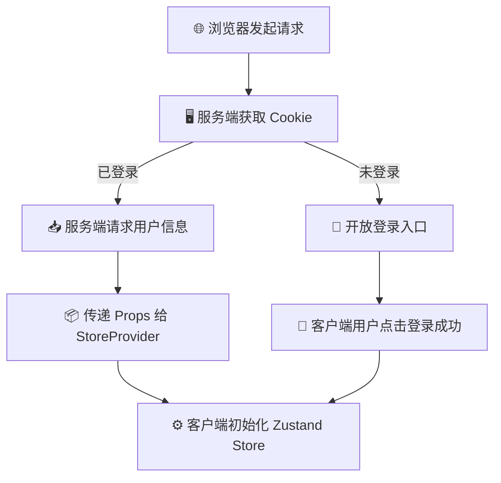

# 深入理解：服务端（RSC）与客户端（RCC）的区别

在学习过程中，我发现自己以前疏忽了一些服务端页面（RSC）开发中的核心理念，大部分时候仍然在使用传统的单页应用（SPA）开发思路。在现代 React / Next.js 开发中，我们需要清晰地划分这两者：

* 🖥️ **服务端（Server Components）**：最靠近数据库和服务器的一端。直接由服务器进行渲染，可以直接输出静态的 HTML 内容。因为在服务端运行，所以**不能**使用点击事件、`useRef`、`useEffect` 等浏览器端的交互和 Hook。其优势在于可以直接调用数据库和内部 API，主要负责数据的拉取、组装和首屏展示。
* 📱 **客户端（Client Components）**：更贴近于传统的前端开发模式（如传统的 Vue / React 开发）。在这里可以正常使用点击事件、浏览器 API 以及各种状态管理（如 Zustand）。主要负责复杂的页面交互、表单处理、动画效果等。

---

## 🔍 看起来很简单？我们看一个实际问题

在实际开发中，我们需要进行大量的状态和逻辑区分。比如下面这个看似简单的登录步骤：

1. 👤 用户进入首页
2. 🔑 用户点击登录
3. 🎉 用户登录成功
4. 🔄 通过 Zustand 把数据同步给其他组件

如果是在平时传统的 React 单页应用中开发，我们可以直接使用常规的数据流：在页面初始化时调用 `useEffect` 检查本地是否有 Token 或数据缓存，如果有则将其推入 Store 中；如果没有，则在用户点击登录并成功后，再将数据同步给其他组件。

> [!IMPORTANT]
> **引入了服务端组件（RSC）与客户端组件（RCC）的区别后，这里出现了一个很明显的问题：**
> 在纯服务端组件中，我们是无法正常运行 `useEffect` 和 Zustand 等客户端 API 的。

### ❓ 为什么会这样？

* 🚫 **运行环境的限制**：Zustand 等第三方状态管理库的运行时强依赖于浏览器环境。像 `useStore` 等 API 本质上依赖于 `useEffect` 和全局事件订阅，这些在纯服务端渲染阶段是无法生效的。这是 RSC 的基本规则。
* ⚡ **服务端渲染是一次性的**：服务端渲染在服务器端执行完毕后，直接将静态 HTML 发送给浏览器。这与始终存在于浏览器 JS 运行时环境中的状态模块之间，有着天然的割裂。

---

## 🏗️ 我们应该如何在服务端渲染中处理数据流？

经过技术演进，虽然我们仍然需要分离服务端与客户端的数据流，但现在的开发体验已经变得非常便捷了。

其中一个核心原则是：
> [!TIP]
> 💡 **我们可以在服务端组件（Server Component）中嵌入客户端组件（Client Component），但反之则不行。**
> 因为服务端组件可能包含 Node.js 代码或直接操作数据库的代码，这些代码在浏览器环境下是完全无法运行的。

明确了这个前提，我们可以采用以下方案来处理数据流：

* 📥 **服务端请求数据**：在服务端组件中直接获取首屏或用户状态数据。
* 📦 **数据下发给 Provider**：通过 Props 将数据传递给包裹在组件树顶层的 Provider（通常可以设计为无头组件/状态容器）。
* ⚙️ **在 Provider 中初始化状态**：由于 Provider 运行在客户端（首行声明 `"use client"`），它可以在组件首次渲染时将服务端传来的 Props 作为 Zustand Store 的初始值。
* 🛡️ **防御性处理**：在其他消费 Zustand 数据的子组件中做好防御性处理，确保对数据未完成初始化的情况进行合理兼容。

### 🔐 登录场景的具体实现路径

将这一思路应用到用户登录场景，我们可以这样设计数据流：



1. 🛠️ **封装服务端工具函数**：封装 `getSession` 和 `getCookie` 等服务端函数，并在服务端页面中直接调用 Next.js 官方 API 获取 Cookie。
2. 🚦 **服务端判断登录态并请求数据**：
   * **如果有 Cookie**：代表用户已经登录，直接在服务端携带 Cookie 发送请求给后端 API，获取具体的用户数据。
   * **如果没有 Cookie**：代表用户未登录，在页面上放开登录入口（展示登录按钮）。
3. 📦 **状态 Store 的设计与初始化**：封装 Store，并提供一个可以接收初始数据并创建 Store 实例的方法。
4. 🪟 **封装客户端 Provider 组件**：封装一个 `StoreProvider`，在其中通过 Props 接收来自服务端的数据，并在组件渲染前调用 Store 的初始化方法。
5. 🪵 **组件树挂载与多路适配**：
   * 将 `StoreProvider` 放置在组件树的顶层。
   * **已登录路径**：直接在服务端将拿到的用户数据通过 Props 传给 `StoreProvider` 完成初始化。
   * **未登录路径**：用户在客户端点击登录成功后，通过 Store 的 Action 动态写入和更新状态。

通过这样两条路径的划分，服务端与客户端的数据交互方式就非常完善和清晰了。

---

## ⚠️ 注意事项：防范水合报错（Hydration Error）

在上述数据流方案中，有一个必须引起高度重视的问题，那就是**水合报错**。

### 🧩 什么是水合报错？

我们需要先理解服务端渲染（SSR）的本质过程：

* 📦 **传统的 SPA（单页应用）**：浏览器下载一个几乎空白的 HTML，然后下载并解析巨大的 JS 文件，最后由 JS 在浏览器端动态生成并挂载整个 DOM 树。
* ⚡ **SSR（服务端渲染）**：服务端在接收到请求后，在后台迅速将 React 组件树渲染成一段纯静态的 HTML 代码（包含了基本的 DOM 骨架 🩻 和文字，但没有任何交互逻辑）并返回给浏览器。浏览器能够瞬间展示该网页。随后，浏览器下载打包好的 JS 代码，JS 会在已有的 HTML 节点上将事件监听器、State 状态等一个个“绑定/挂载”上去，这个过程就叫做**水合（Hydration / 激活）**。

> [!WARNING]
> **水合报错（Hydration Error）** 指的就是：**客户端首次计算出来的 DOM 树结构/内容，与服务端渲染生成的 HTML 树没有实现一一对应。**

### 🛡️ 如何规避水合报错？

为了规避水合报错，我们必须确保服务端与客户端初始渲染的数据源和 DOM 树完全一致。

例如，在服务端请求完数据后，将数据通过 Props 强行传递给客户端子组件，而不是让客户端组件在挂载时自己去计算一个不同的初始值：

```typescript
// 🖥️ 在服务端组件中：
const userAuth = await checkUserLogged(cookies()); // 结果为 true

// 📱 强制把 true 作为 Prop 传给客户端组件，确保两端初始状态完全一致
return <UserHeader isLogged={userAuth} />
```

在 Next.js（App Router）中，服务端的异步请求会强行等待执行完毕（除非使用了 Streaming / Suspense 异步流），渲染该组件时所使用的数据会伴随着一段 JSON 数据一并发送给浏览器，供客户端水合时直接使用，从而完美避免了由于两端数据不一致导致的水合报错。
